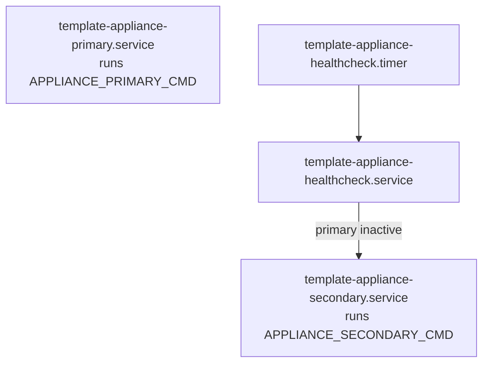

# template-appliance

Reusable Bash + systemd appliance skeleton built around a simple model:

- Primary mode: run your main workload (`APPLIANCE_PRIMARY_CMD`)
- Secondary mode: run a fallback workload (`APPLIANCE_SECONDARY_CMD`)
- Healthcheck timer: if primary is not active, start secondary

This repo is intentionally minimal: you provide the commands and any extra packages.

## Documentation

- [Architecture](docs/architecture.md)
- [Config examples](docs/config-examples.md)
- [Glossary](docs/glossary.md)

## Quick start (dev + CI)

Build the devcontainer image:

```bash
docker build -t template-appliance-devcontainer -f .devcontainer/Dockerfile .
```

Run the full CI pipeline inside it:

```bash
docker run --rm \
  -v "$PWD:/work" \
  -w /work \
  template-appliance-devcontainer \
  bash -lc './scripts/ci.sh'
```

Or, use the Makefile (requires `make` + Docker on your host):

```bash
make ci
```

See [CONTRIBUTING.md](CONTRIBUTING.md) for the required pre-PR checks.

## Runtime model

At a glance, systemd manages three key units:

- `template-appliance-primary.service`
- `template-appliance-secondary.service`
- `template-appliance-healthcheck.timer` (runs `template-appliance-healthcheck.service`)



## Installation (cloud-init / Pi Imager)

The recommended install flow is:

1. cloud-init writes `/etc/template-appliance/config.env`.
2. cloud-init installs a one-time installer unit + bootstrap script.
3. systemd runs `template-appliance-install.service` until install succeeds.

Examples:

- [examples/pi-imager/user-data.example.yml](examples/pi-imager/user-data.example.yml)
- [cloud-init/user-data.example.yml](cloud-init/user-data.example.yml)

## Configuration

Runtime configuration lives in `/etc/template-appliance/config.env`.

Required (first-boot bootstrap):

- `APPLIANCE_REPO_URL`
- `APPLIANCE_REPO_REF` (branch/tag/commit; pinning to a tag/commit is recommended)

Required (runtime modes):

- `APPLIANCE_PRIMARY_CMD`
- `APPLIANCE_SECONDARY_CMD`

Optional:

- `APPLIANCE_CHECKOUT_DIR` (default: `/opt/template-appliance`)
- `APPLIANCE_INSTALLED_MARKER` (default: `/var/lib/template-appliance/installed`)
- `APPLIANCE_APT_PACKAGES` (space-separated extra packages for install)
- `APPLIANCE_PRIMARY_SERVICE` / `APPLIANCE_SECONDARY_SERVICE` (override healthcheck targets)
- `APPLIANCE_DRY_RUN=1` (do not modify system; record intended actions)

## Day-2 operations

Switch modes:

```bash
systemctl start template-appliance-primary.service
systemctl start template-appliance-secondary.service
```

Inspect install/boot status:

```bash
systemctl status template-appliance-install.service --no-pager
ls -l /var/lib/template-appliance/installed || true
```

## Manual install (no cloud-init)

If you cannot use cloud-init, you can install via SSH.

1. Install prerequisites:

```bash
sudo apt-get update
sudo apt-get install -y --no-install-recommends ca-certificates curl git
```

1. Create `/etc/template-appliance/config.env` (start from the example):

```bash
sudo mkdir -p /etc/template-appliance
sudo cp /path/to/template-appliance/examples/config.env.example /etc/template-appliance/config.env
sudo nano /etc/template-appliance/config.env
```

1. Clone the repo and run the installer as root:

```bash
git clone https://github.com/your-org/template-appliance.git /opt/template-appliance
cd /opt/template-appliance
sudo ./scripts/install.sh
```
