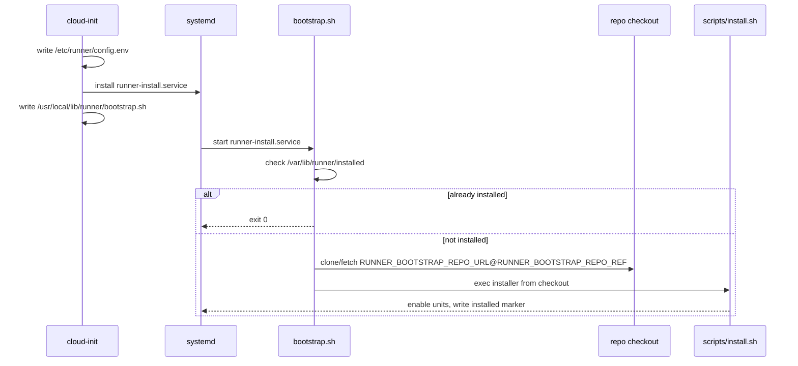

# Architecture

This document explains how runner fits together, in plain language.

runner is a systemd-managed appliance for running a single GitHub Actions self-hosted runner.

The runner process lives on the host.
When a workflow runs job steps “in a container”, those steps are intended to run inside an ephemeral
`systemd-nspawn` guest.

If `systemd-nspawn` is new to you: it’s a lightweight way to boot a small Linux userspace
with systemd as PID 1.
In this repo we create the guest for a job, run the step(s), then throw the guest away.

## Glossary

See [Glossary](glossary.md).

## Goals

- Keep host lifecycle predictable (systemd unit for install, systemd unit for runner).
- Make first-boot installs idempotent and retryable.
- Avoid Docker at runtime by routing containerized jobs through `systemd-nspawn`.

Non-goals (helpful framing):

- This is not a multi-runner fleet manager.
- This is not trying to replace GitHub Actions; it’s a runner installation with a strict runtime model.

## High-level component map

```mermaid
flowchart TD
  subgraph HOST[Linux host]
    SYSTEMD[systemd]
    INSTALL[runner-install.service]
    RUNNER[runner.service]
    HOOKS[ACTIONS_RUNNER_CONTAINER_HOOKS\ncontainer-hooks.sh]
    NSPAWN[ci-nspawn-run\n(systemd-nspawn + systemd-run -M)]
  end

  SYSTEMD --> INSTALL
  SYSTEMD --> RUNNER
  RUNNER --> HOOKS
  HOOKS --> NSPAWN
```

Configuration is loaded from `/etc/runner/config.env`.

## Systemd units

Install-time:

- `runner-install.service`: one-time installer (first boot; retried until it succeeds).

Runtime:

- `runner.service`: runs `/usr/local/lib/runner/runner-service.sh`.

## Installed layout

- `/etc/runner/config.env`: runtime configuration.
- `/usr/local/lib/runner/*.sh`: installed scripts.
- `/usr/local/lib/runner/lib/*.sh`: shared lib helpers.
- `/usr/local/bin/ci-nspawn-run`: helper used by container hooks.
- `/var/lib/runner/installed`: one-time install marker.

## Boot and installation flow

First boot is designed to be idempotent (it is safe to retry).

The mental model:

- cloud-init lays down a minimal config + installer unit + bootstrap.
- systemd runs the installer unit.
- bootstrap clones the pinned repo ref and execs the real installer.



If you want to re-run install without reflashing, delete the marker file and restart the unit:

```bash
sudo rm -f /var/lib/runner/installed
sudo systemctl restart runner-install.service
```

## GitHub runner container hooks

`runner-service.sh` sets `ACTIONS_RUNNER_CONTAINER_HOOKS` when `container-hooks.sh` is present.

This is intended to allow the runner to execute containerized jobs without Docker.
The runner calls the hook script with a small JSON payload; our hook implementation translates that
into a `ci-nspawn-run` invocation.

Limitations:

- Hooks are only used by the runner in scenarios where it runs steps in a container
  (for example: workflows using job `container:`).
- `run_container_step` is not implemented (only `run_script_step` is routed).
