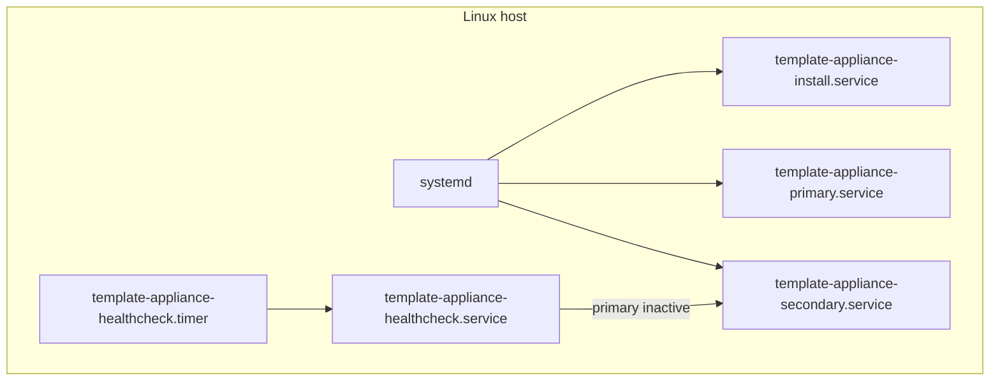
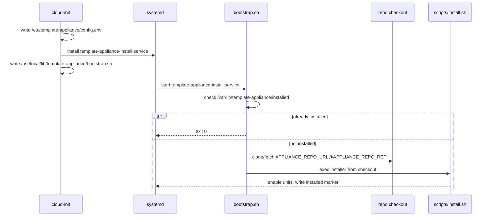

# Architecture

template-appliance is a reusable skeleton for a systemd-managed appliance.

The design goal is a small, copyable “runner” that you can adapt by setting commands in a config file.

## Glossary

See [Glossary](glossary.md).

## Goals

- Provide a predictable baseline for a systemd-managed appliance.
- Support two modes:
  - Primary mode: your main workload.
  - Secondary mode: a fallback workload.
- Make first-boot installs idempotent and retryable.

## High-level component map



Configuration is loaded from `/etc/template-appliance/config.env`.

## Systemd units

Install-time:

- `template-appliance-install.service`: one-time installer (first boot; retried until it succeeds).

Runtime:

- `template-appliance-primary.service`: runs `/usr/local/lib/template-appliance/primary-mode.sh`.
- `template-appliance-secondary.service`: runs `/usr/local/lib/template-appliance/secondary-mode.sh`.
- `template-appliance-healthcheck.timer`: periodically runs `template-appliance-healthcheck.service`.

## Installed layout

- `/etc/template-appliance/config.env`: runtime configuration.
- `/usr/local/lib/template-appliance/*.sh`: installed scripts.
- `/usr/local/lib/template-appliance/lib/*.sh`: shared lib helpers.
- `/var/lib/template-appliance/installed`: one-time install marker.

## Boot and installation flow

First boot is designed to be idempotent (it is safe to retry).

The mental model:

- cloud-init lays down a minimal config + installer unit + bootstrap.
- systemd runs the installer unit.
- bootstrap clones the pinned repo ref and execs the real installer.



If you want to re-run install without reflashing, delete the marker file and restart the unit:

```bash
sudo rm -f /var/lib/template-appliance/installed
sudo systemctl restart template-appliance-install.service
```

## Mode behavior

The mode runners execute your commands:

- Primary: `bash -lc "$APPLIANCE_PRIMARY_CMD"`
- Secondary: `bash -lc "$APPLIANCE_SECONDARY_CMD"`

If a command is missing, the service logs and sleeps (so the unit stays active and you can update config without
rapid restart loops).

## Healthcheck/failover

The healthcheck service checks whether the primary service is active.

- If primary is active, it exits success.
- If primary is inactive, it starts the secondary service.

By default it checks `template-appliance-primary.service` and starts `template-appliance-secondary.service`, but you
can override them via `APPLIANCE_PRIMARY_SERVICE` and `APPLIANCE_SECONDARY_SERVICE`.
